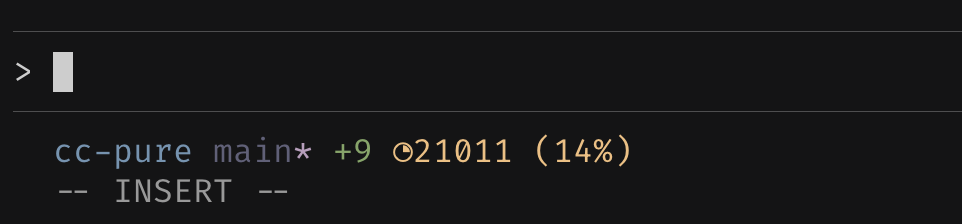

# cc-pure

A fast, minimal status line for [Claude Code](https://claude.com/claude-code), written in Zig and inspired by the [pure](https://github.com/sindresorhus/pure) ZSH prompt.

```text
user/projects/myapp main* ⇣⇡ +20 -81 34,040 (79%)
```



## Features

- **Fast and lightweight** - Written in Zig with concurrent Git status fetching
- **Git integration** - Shows branch name, dirty status, and upstream sync state
- **Context tracking** - Displays Claude context usage with visual indicator
- **Session metrics** - Tracks lines added/removed during your session
- **Themeable** - Compile-time theme support (Vague, Tokyo Night)
- **Smart CWD** - Simplifies working directory path (up to 3 components, max 300 chars)

### Status Line Components

| Component | Description                                      | Example               |
| --------- | ------------------------------------------------ | --------------------- |
| `cwd`     | Current working directory (up to 3 folders deep) | `user/projects/myapp` |
| `branch`  | Git branch name (if in a repo)                   | `main`                |
| `dirty`   | `*` indicator for uncommitted changes            | `*`                   |
| `sync`    | Upstream sync status                             | `⇣⇡` (behind/ahead)   |
| `context` | Claude context usage with visual bar             | `󰪡 34,040 (79%)`      |
| `changes` | Lines added/removed in session                   | `+20 -81`             |
| `cost`    | Cost of current session in USD                   | `$0.24`               |

## Installation

Build the binary and move it to `~/.claude/cc-pure`.

Add this to your `~/.claude/settings.json`:

```json
{
  "statusLine": {
    "type": "command",
    "command": "~/.claude/cc-pure"
  }
}
```

### Themes

cc-pure supports compile-time themes. Currently available:

- **vague** (default) - Inspired by the Vague color scheme
- **tokyo_night** - Tokyo Night inspired colors

To build with a specific theme:

```bash
zig build -Dtheme=tokyo_night -Doptimize=ReleaseSafe
```

## How it works

cc-pure uses concurrent processing to minimize latency:

1. **Main thread** - Parses session data from stdin
2. **Git thread** - Fetches repository status in parallel
3. **Usage thread** - Calculates context usage from transcript
4. **Formatter** - Combines all data and outputs the status line

### Performance considerations

- Sets `GIT_OPTIONAL_LOCKS=0` to prevent git operations from locking
- Uses arena allocators for efficient memory management
- Runs expensive operations (git, usage calculation) concurrently

## Development

### Prerequisites

- `zig` version 0.15.
- A terminal with Nerd Font support (recommended)

### Build from source

```bash
git clone https://github.com/yourusername/cc-pure.git
cd cc-pure
zig build -Doptimize=ReleaseSafe
```

The compiled binary will be at `zig-out/bin/cc_pure`.

### Build options

```bash
# Build with a specific theme
zig build -Dtheme=tokyo_night

# Build without Nerd Font support
zig build -Dnerd=false
```

### Running tests

```bash
zig build test
```

To test with `claude`, you can add `2>~/cc-pure/log.txt`, which will
reroute the stderr logging to a text file.

### Project structure

```
src/
├── main.zig           # Entry point with concurrent orchestration
├── root.zig           # Module exports
├── status_line.zig    # Status line formatting logic
├── Session.zig        # JSON parsing for Claude session data
├── git_status.zig     # Git repository status fetching
├── usage.zig          # Context usage calculation
└── theme.zig          # Theming system
```

## Contributing

Contributions are welcome! Please feel free to submit a Pull Request.

### Guidelines

- Follow `STYLE_GUIDE.md`
- Add tests for new functionality
- Keep changes focused and atomic
- Ensure `zig build test` passes

## Acknowledgments

- Inspired by [pure](https://github.com/sindresorhus/pure) ZSH prompt
- Built for [Claude Code](https://claude.com/claude-code)

## Related Projects

- [claude-powerline](https://github.com/Owloops/claude-powerline) - A powerline-style status line for Claude Code
